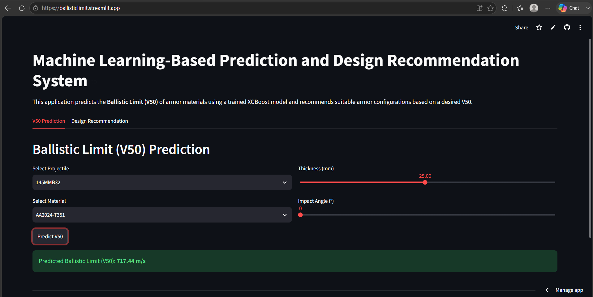
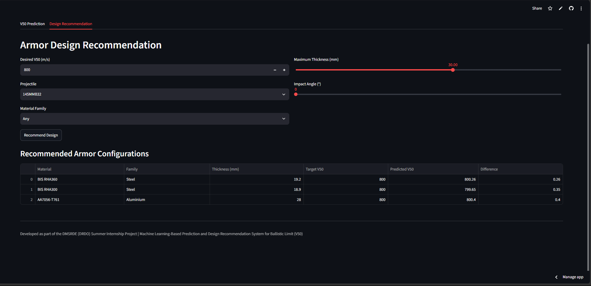

# Ballistic Limit (V50) Prediction and Recommendation System

A Machine Learning project developed during my **Summer Internship at DMSRDE (DRDO), Kanpur** to predict the **Ballistic Limit (V50)** of armor materials and recommend suitable armor configurations.

## Features

- Predicts Ballistic Limit (V50) using an XGBoost Regression model.
- Recommends suitable armor material and thickness for a desired V50.
- Interactive Streamlit web application.
- Feature importance and SHAP-based model explainability.

## Tech Stack

- Python
- Pandas
- NumPy
- Scikit-learn
- XGBoost
- Streamlit
- Matplotlib

## Project Structure

```
├── app.py
├── requirements.txt
├── data/
├── models/
├── reports/
└── src/
```

## Model Performance

- **R² Score:** 0.9138
- **MAE:** 27.22 m/s
- **RMSE:** 42.10 m/s

## Screenshots

### V50 Prediction



### Design Recommendation



## Run Locally

```bash
pip install -r requirements.txt
streamlit run app.py
```

## Author

**Prachi Yadav**  
B.Tech Computer Science Engineering  
Jaypee Institute of Information Technology
